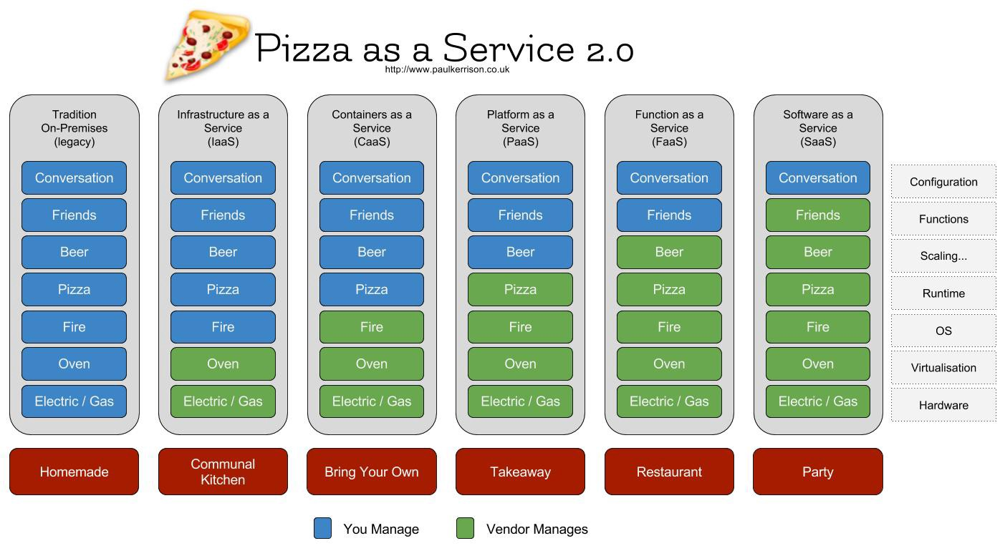
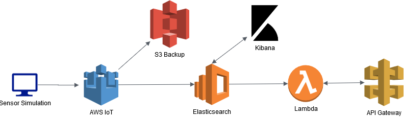
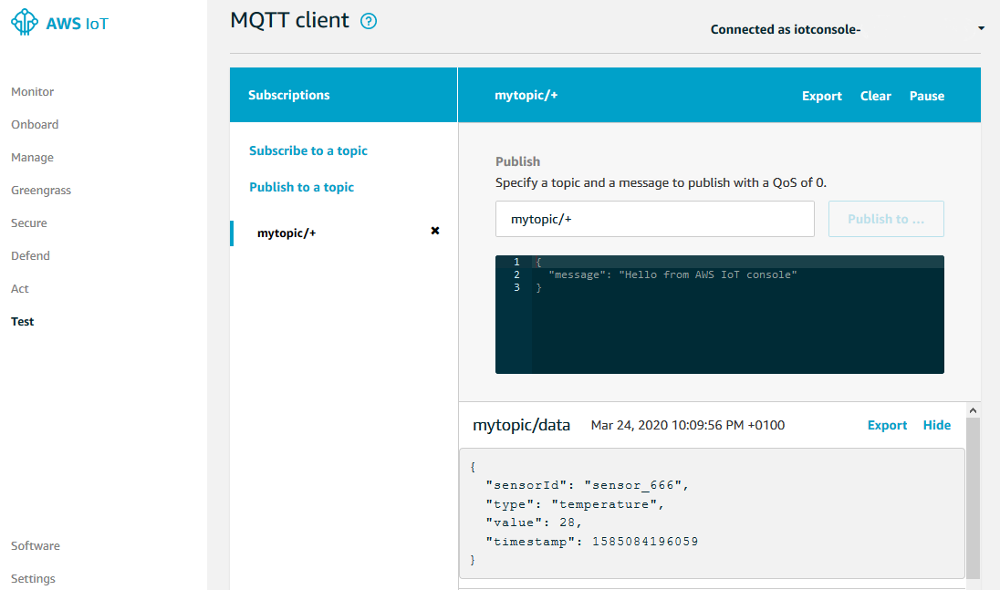
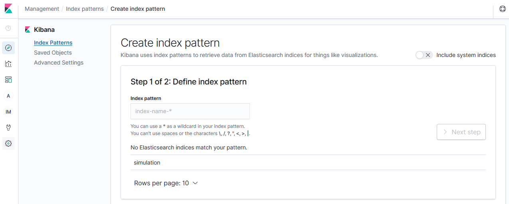

# aws-get-started

Example project to show usage of some AWS services

## AWS Introduction

Amazon Web Services


### History

Detailed: <https://en.wikipedia.org/wiki/Timeline_of_Amazon_Web_Services>

- 2002: AWS Platform launched
- 2006: Officially launched with 3 services (EC2, S3, SQS)
- 2010: (Microsoft Azure was launched)
- 2014: AWS Lambda was launched
- 2017: SageMaker was launched

### Competitors

As for 2020 the market is roughly shared as following:

| Cloud Provider  | Market Share  | Details |
| :-------------: |:-------------:| :------:|
| AWS             | 32.4 %        |         |
| Azure           | 17.6 %        |         |
| Google Cloud    | 6 %           |         |
| Alibaba Cloud   | 5.4 %         |         |
| Others          | 38.5 %        |         |

Cloud Market Share: <https://kinsta.com/blog/cloud-market-share/>

### AWS Services

As for 2020 there are more than **212** services!

Here a list of some of the most popular services:

- EC2 (Compute)
- S3 (Storage)
- Lambda (Compute)
- CloudFront, VPC (Network)
- RDS, DynamoDB (Database)
- IAM (Security)
- SageMaker (Machine Learning)
- CodeCommit, CodeBuild, CodePipeline (Dev tools)
- CloudWatch (Management)
- IoT (Internet of things)
- ...

### General Terms

#### aaS

Cloud abstracts the infrastructure. Depending on the level of abstraction, different terms are being used:



Besides Iaas, Paas and Saas many other terms exist like Faas (Function as a service), Caas (Container as a service), ...

List of ...aas: <https://en.wikipedia.org/wiki/As_a_service>

## AWS - How to get started

As usual, this depends and there are many ways that lead to rome.

My suggestion:

1. Sign up for an account (<https://aws.amazon.com>, <https://portal.aws.amazon.com/billing/signup#/start>), or get access to an existing account (Noser?)
2. Play around with AWS Console (UI) and build "something"
3. Download AWS cli (<https://aws.amazon.com/de/cli/>) and use it for some services
4. Read further details online and read AWS docs as needed (<https://docs.aws.amazon.com/>)
5. Get further knowledge by attending some of the free online courses or get certified

## Courses, Trainings

AWS has lots of free online courses and also a vast offer on certifcations

Some links:

- <https://acloud.guru/aws-cloud-training>
- <https://www.udemy.com/courses/search/?src=ukw&q=aws>
- <https://www.aws.training/>
- ...

## Events

Checkout out:

- <https://aws.amazon.com/de/events/>
  - re:Invent (THE event in Las Vegas)
  - AWS Summit (held in many countries, e.g. Baden, Switzerlan)
  - AWSome Day - Online Conference (free online conference)
- ...

## AWS Hands On

### Overview

Lets try to build the following:



Lets do the following order:

1. Define AWS IoT Thing and certificates
2. Create and test it with a local node.js application
3. Define an IoT Rule for sending data to Elasticsearch
4. Lets see if we see some data in Kibana
5. Build a lambda with node.js (or whatever you like) for reading data from
6. Define a restful API and integrate it with lambda
7. Test the API and the setup end 2 end

#### 0. Prerequisites

- AWS Account
- AWS CLI setup
- Node installed locally
- Visual Studio Code or other editor

#### 1. AWS IoT

#### Create Certificates

- Login to console (always make sure the right REGION is selected!) and create a thing
- Use one click certificate creation and download certificates locally
- Activate the certificate!
- Add a policy to certificate that enables the holder of the certificates to talk to IoT core
- You can define a broad policy but ideally limit the policy as much as you can
- The follwing policy limits a connection to a single clientId (SensorClientId) and allows publish only to a specific topic (including all child topics)

  ```json
  {
      "Version": "2012-10-17",
      "Statement": [
          {
              "Effect": "Allow",
              "Action": [
                  "iot:Connect"
              ],
              "Resource": [
                  "arn:aws:iot:eu-west-1:xxx:client/SensorClientId",
              ]
          },
          {
              "Effect": "Allow",
              "Action": [
                  "iot:Publish"
              ],
              "Resource": [
                  "arn:aws:iot:eu-west-1:xxx:topic/mytopic/data/*"
              ]
          }
      ]
  }
  ```

### 2. Create and Run simulation

- Lets post data to topic IoT topic **mytopic/data**
- Write your sensor simulation script and run it locally (see /sensor_simulation folder for starting point - adapt the used certificates).
  - Optionally use AWS CLI to post a message (i setup my private AWS account in a 'priv' profile)
  
    ```bash
    export AWS_PROFILE=priv
    # publish a basic message
    aws iot-data publish --topic 'mytopic/data' --payload '{"points": [{"description": "Temperature Fridge", "name": "test", "timestamp": "03/06/2020 13:21:32", "value": "3.650"}]}'
    ```

- The IoT endpoint you find under AWS IoT - Settings
  - Or use AWS CLI

    ```bash
    aws iot describe-endpoint
    ```

- Check at IoT Core under Test that message is being received
  - Subscribe to the defined topic: mytopic/+ 
    

### 3. Define IoT Rule to Elasticsearch

In the AWS IoT Core service we can define a 'rule' that forwards the received message to other services.
We are going to choose a direct integration with Elasticsearch Service:

- Go to IoT Core - Act and add a rule -> lets call it 'simulation_data'

  ```shell
  SELECT topic(3) as building_id * FROM 'mytopic/data/+'
  ```

- Add an action and configure it
- Create an Elasticsearch cluster - use defaults for simplicity but choose 'Public Access' and remove 'fine-grained access control'
- Review the settings and confirm
- The creation of elasticsearch may take some minutes -> check 'domain status'
- Go back to the IoT Rule - Action Tab that forwarded to the Elasticsearch configuration
  - Now you should be able to select the created domain 'simulationdata' and if domain is 'active' the endpoint should appear


### 4. Lets see if we see some data in Kibana

Depending on the chosen Elasticsearch config and the used policy access to Kibana will need 'request signing. For simplicity we manually whitelist in the Elasticsearch policy our IP address:

- Go to Elasticsearch Service - Actions - Modify Access Policy
- Add your public IP Address (<http://www.myipaddress.com>)

  ```json
  {
    "Version": "2012-10-17",
    "Statement": [
      {
        "Effect": "Allow",
        "Principal": {
          "AWS": "arn:aws:iam::xxx:user/xxx@yyy.com"
        },
        "Action": "es:*",
        "Resource": "arn:aws:es:eu-west-1:xxx:domain/simulationdata/*"
      },
      {
        "Effect": "Allow",
        "Principal": {
          "AWS": "*"
        },
        "Action": "es:*",
        "Resource": "*",
        "Condition": {
          "IpAddress": {
            "aws:SourceIp": [
              "xx.yy.zz.0/24"
            ]
          }
        }
      }
    ]
  }
  ```

- Now you should be able to access Kibana and see the simulated data
- First you need to create a so called 'index pattern' in Kibana in order to analyze data
  
- If certain fields are not mapped as expected -> check out Elasticsearch documentation (<https://www.elastic.co/guide/en/elasticsearch/reference/current/index.html>)
- Here an example for how to define an explicit mapping in Kibana - Dev Tools (be aware that mapping API changes over ES versions and mapping type is being removed in ES 8.0 onwards)

  ```json
  # Delete index
  DELETE simulation

  # Create index
  PUT simulation

  # Define mapping
  PUT simulation/_mapping/simulationType?include_type_name=true
  {
    "simulationType": {
      "properties": {
        "building_id": {
          "type": "text",
          "fields": {
            "keyword": {
              "type": "keyword",
              "ignore_above": 256
            }
          }
        },
        "sensorId": {
          "type": "text",
          "fields": {
            "keyword": {
              "type": "keyword",
              "ignore_above": 256
            }
          }
        },
        "timestamp": {
          "type": "date"
        },
        "type": {
          "type": "text",
          "fields": {
            "keyword": {
              "type": "keyword",
              "ignore_above": 256
            }
          }
        },
        "value": {
          "type": "long"
        }
      }
    }
  }
  ```

- As a next step you could visualize your data in Kibana

### 5. Build a lambda function

- Go to lambda service in AWS console
- 'Create Function' with function name getSimulationData. Use Runtime of your choice (e.g. Node.js 12.x)
- Lets create a new policy 'ReadAndWriteEsAccess' that allows the lambda to access Elasticsearch

  ```json
  {
      "Version": "2012-10-17",
      "Statement": [
          {
              "Effect": "Allow",
              "Action": [
                  "es:ESHttpPost",
                  "es:ESHttpGet",
                  "es:ESHttpPut"
              ],
              "Resource": "arn:aws:es:eu-west-1:xxx:domain/simulationdata"
          }
      ]
  }
  ```

- Now create an Role 'AllowEsAccess' and attach the created policy to it
- Once the lambda is created, go to execution role section and change the role to our created role
- Now we can defien our lambda code
  - As a starting point checkout <https://github.com/aws-samples/amazon-elasticsearch-lambda-samples/blob/master/src/kinesis_lambda_es.js>

### 6. Create API

Define your API using Swagger editor for instance: <https://swagger.io/tools/swagger-editor/>

Lets simply start with a Read operation for our simulation data.
Go to AWS Api Gateway sercice and define a new endpoint.

### 7. Test the API

I recommend using postman <https://www.postman.com/> (or curl if you prefer) for testing the API by sending API requests.

## Varia

### Cloud Native Computing Foundation

Cloud Native Computing Foundation has some interesting infos <https://landscape.cncf.io/>

- <https://landscape.cncf.io/>
- ...

### Datacenters

Here a list to view the physical datacenters: <https://wikileaks.org/amazon-atlas/map/>

### Reference Architecture

For building stuff its worth having a look at the AWS reference architecture: <https://aws.amazon.com/de/lambda/resources/reference-architectures/>

### Service Comparison

Most services have a pendant in other cloud providers.
Here an comparison from AWS and Azure <https://docs.microsoft.com/en-us/azure/architecture/aws-professional/services>
